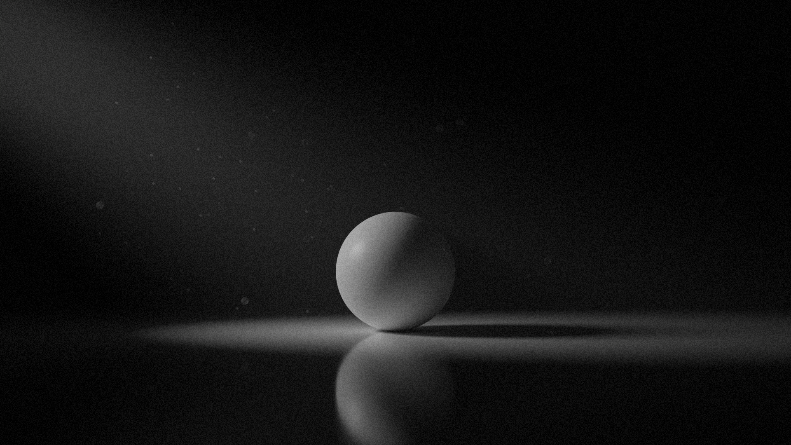
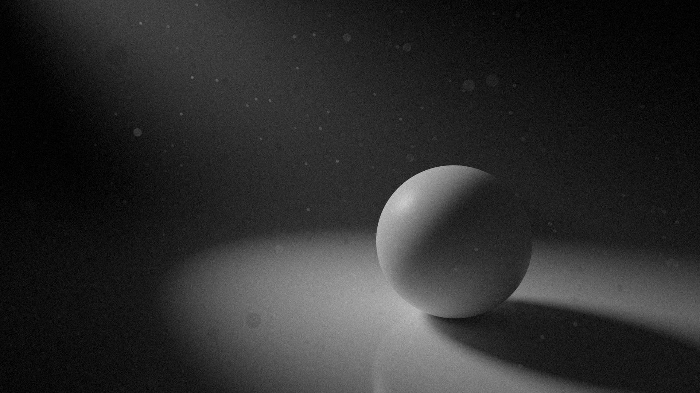
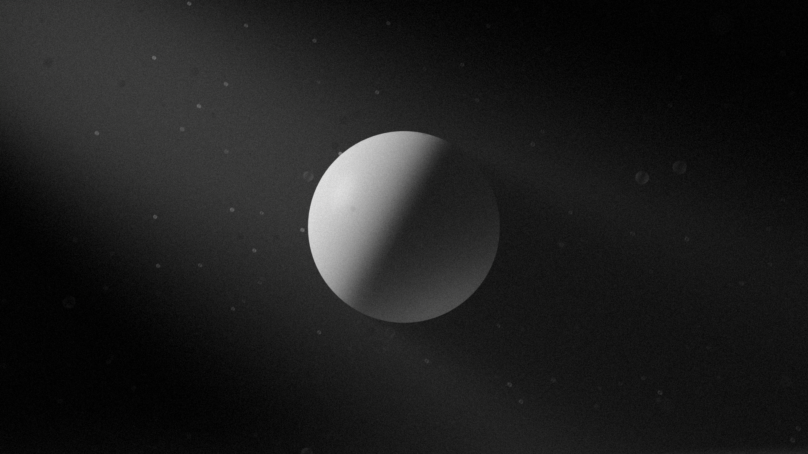

import imageHero from './hero.png'

export const experiment = {
  title: 'Dust & Light',
  description:
    'Geometry nodes are becoming a prominent force within Blender, similar to how dust gracefully fills a space. In this experiment, I illuminated the presence of dust particles, capturing the way they float on the air.',
  image: { src: imageHero },
  date: '2022-08',
  service: '3D Effects',
}

export const metadata = {
  title: experiment.title,
  description: experiment.description,
}

Geometry nodes are becoming a prominent force within Blender, similar to how dust gracefully fills a space. In this experiment, I illuminated the presence of dust particles, capturing the way they float in the air.

This effect was possible thanks to two things: volume scatter, and Blender’s new Geometry Nodes.

Volume scatter creates that beam of light by dispersing the light paths prior to their contact with the ground.

I used Geometry Nodes to scatter the particles of dust around the scene, which is a great way to create this effect. Doing it procedurally means you can also animate it — just keyframe the `w` property and the dust will gently float about in the air.

---

And that’s my experimentation on dust and light. This could be particularly useful in 3D environments to add a subtle touch of realism, which really adds something to a render.
