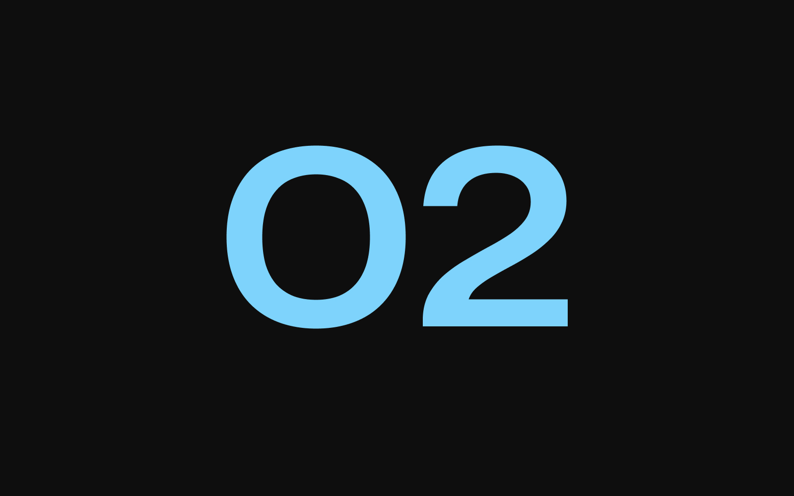

import imageHero from './hero.jpg'

export const experiment = {
  title: 'Experiment 2',
  description:
    'Lorem ipsum dolor, sit amet consectetur adipisicing elit. Magnam neque nihil voluptatem eveniet sequi, velit iure cupiditate harum consequatur distinctio nulla facere minima accusamus! Alias, fuga laboriosam.',
  image: { src: imageHero },
  date: '2022-05',
  service: '3D Art',
}

export const metadata = {
  title: experiment.title,
  description: experiment.description,
}

## Experiment 2

Lorem ipsum dolor, sit amet consectetur adipisicing elit. Aliquam vitae magnam, sequi sunt dolorem commodi. Aut pariatur nesciunt est tempora voluptate temporibus, magnam vitae. Assumenda pariatur qui eos ab hic quos explicabo mollitia aperiam debitis eveniet magnam reprehenderit numquam dicta id quas, quasi cum ex quaerat, cumque dolore repellendus laudantium.

Assumenda pariatur qui eos ab hic quos explicabo mollitia aperiam debitis eveniet magnam reprehenderit numquam dicta id quas, quasi cum ex quaerat, cumque dolore repellendus laudantium. Aut pariatur nesciunt est tempora voluptate temporibus, magnam vitae. Aliquam vitae magnam, sequi sunt dolorem commodi.

### Pariatur laudantium

- **Repellendus** — dolore repellendus laudantium.
- **Assumenda** — voluptate temporibus, magnam vitae.
- **Reprehenderit** — mollitia nesciunt est tempora.

Aliquam vitae magnam, sequi sunt dolorem commodi. Aut pariatur nesciunt est tempora voluptate temporibus, magnam vitae.
