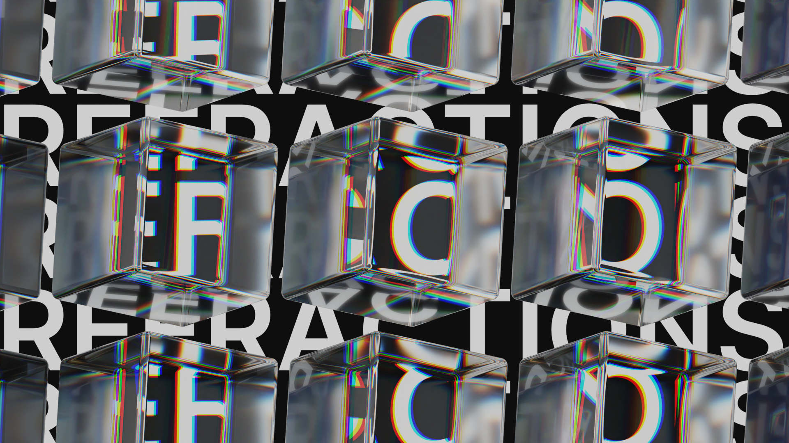
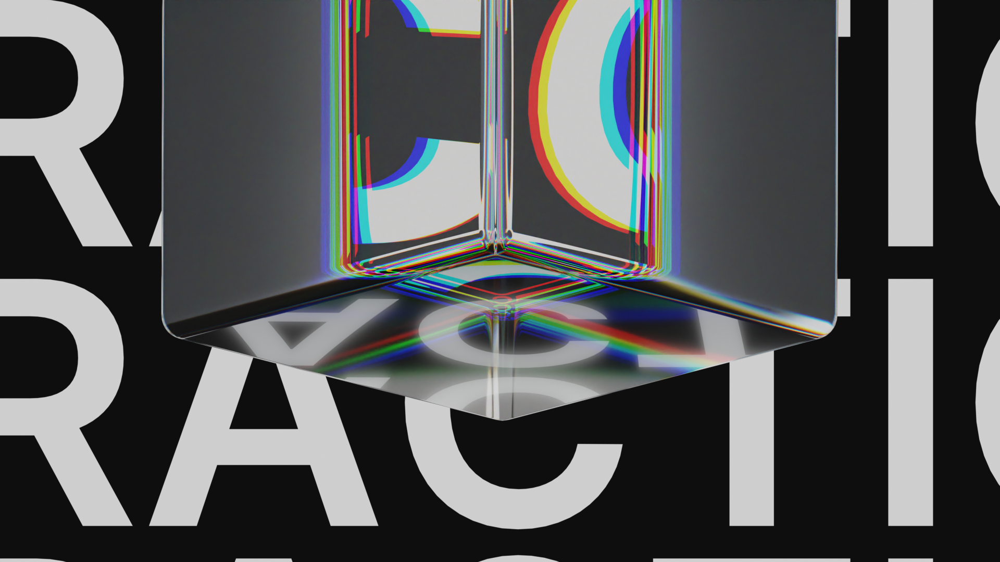
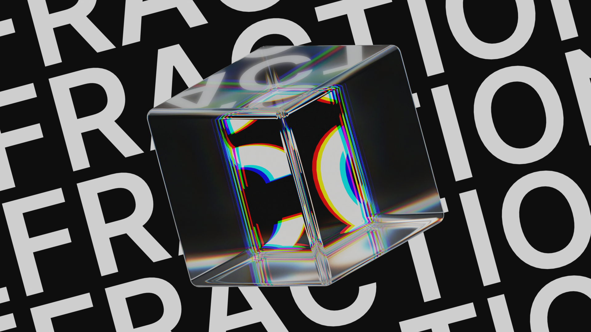

import imageHero from './hero.webp'

export const experiment = {
  title: 'Refractions',
  description:
    'Glass is undeniably one of the coolest and most striking 3D effects there is. But I wanted to take this effect futher with refractions — so I rounded the edges of the default cube, created a new material, and got to work.',
  image: { src: imageHero },
  date: '2023-08',
  service: '3D Materials',
}

export const metadata = {
  title: experiment.title,
  description: experiment.description,
}

Glass is undeniably one of the coolest and most striking 3D effects there is. But I wanted to take this effect futher with refractions — so I rounded the edges of the default cube, created a new material, and got to work.

Splitting the glass material into its RBG channels and mixing them really works to achieve this effect — then you can apply this texture to just about anything and it will look awesome.

Text looks especially nice as a backdrop, because of the curves and shapes it makes when it interacts with the glass.

So that's my exploration on glass — I think this technique will be really useful in future projects.
