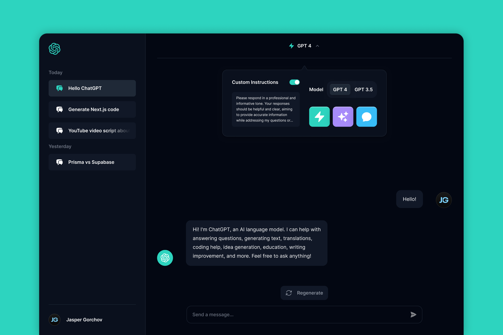
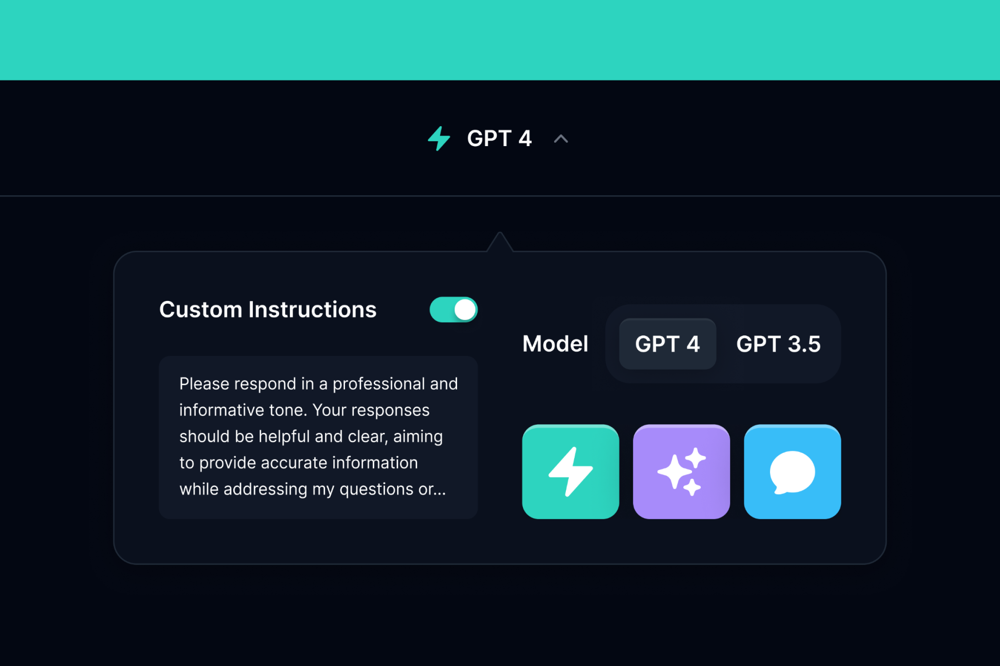

import imageHero from './hero.png'

export const project = {
  title: 'ChatGPT Redesign',
  description:
    'ChatGPT is an amazing tool — but its UI could use some work. That’s why I redesigned it from the ground up, and even added a couple features I thought would be cool.',
  image: { src: imageHero },
  date: '2022-05',
  service: 'UI Design',
}

export const metadata = {
  title: project.title,
  description: project.description,
}

ChatGPT is an amazing tool — but its UI could use some work. That’s why I redesigned it from the ground up, and even added a couple features I thought would be cool.

---

## Design Concept

After using ChatGPT for some time, I began to notice some ways I could improve its UI. The color palette, the settings — eventually I decided I would take the time to create a redesign concept for ChatGPT.

---

## Goals

- **Actions** — I've seen some other AI tools that have a kind of "Quick Actions" feature — a couple of easy-to-access buttons that enable you to send preset messages or set modes. This is something that I feel ChatGPT could benefit from, so I wanted to see what it would look like.

- **Improved Color Palette** — Color has a big impact on UI design, and ChatGPT's palette was lacking something. I used Tailwind’s awesome [color palette](https://tailwindcss.com/docs/customizing-colors) for this project.

- **Simpler Settings** — One thing I noticed while using ChatGPT was that its settings were a little hard to use — there were multiple settings panels in different places, and it was hard to find what you wanted. I aimed to create a single control center that would have everything in one place.

---

All in all, I really like the way this design came out and I'm looking forward to doing more projects like this!
