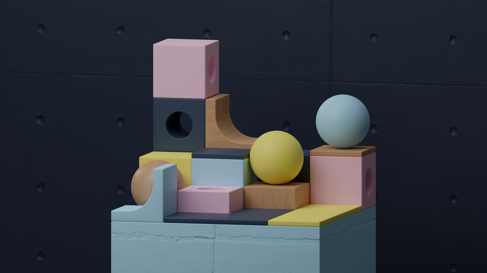
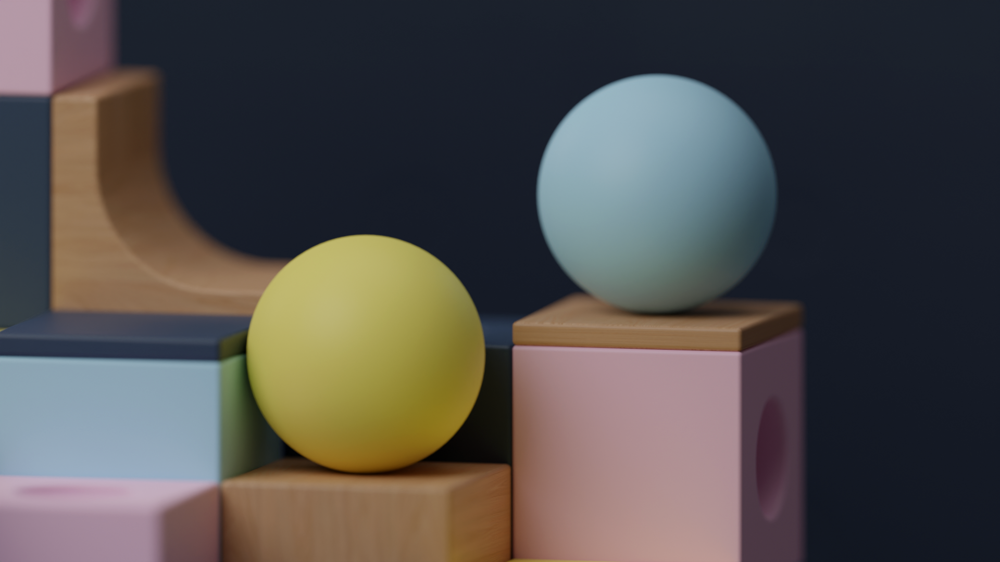
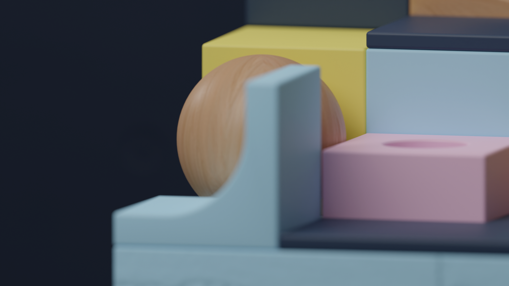

import imageHero from './hero.png'

export const project = {
  title: 'Compositions Vol. 1',
  description:
    'Boxes are used a lot in design — from bento box UIs to 3D work incorporating cubes. This composition of cubes introduces a fresh sense of minimalism and abstraction, using color and texture to emphasize depth and dimension.',
  image: { src: imageHero },
  date: '2023-08',
  service: '3D Design',
}

export const metadata = {
  title: project.title,
  description: project.description,
}

Boxes are used a lot in design — from bento box UIs to 3D work incorporating cubes. This composition of cubes introduces a fresh sense of minimalism and abstraction, using color and texture to emphasize depth and dimension.

---

## Design Concept

I wanted to create an arrangement of cubes atop a base, with a variety of shapes among them. I chose vibrant colors to add a sense of playfulness, while using subtle textures like concrete and wood as contrast.

---

## Goals

- **Variety** — I set out to design a range of distinct 3D shapes that could be reused consistently across the project, utilizing Blender’s Asset Browser.

- **Vibrant Palette** — I wanted infuse the render with a burst of vivid hues, using Tailwind’s wonderful [color palette](https://tailwindcss.com/docs/customizing-colors) to create this style.

- **Textural Depth** — By incorporating realistic textural elements, I aimed to add depth and contrast. This effect was created by the inclusion of wood and concrete elements within the design.

---

In conclusion, this composition of cubes presents a new interpretation of minimalism and abstraction, skillfully employing color and texture to accentuate depth and dimension.
