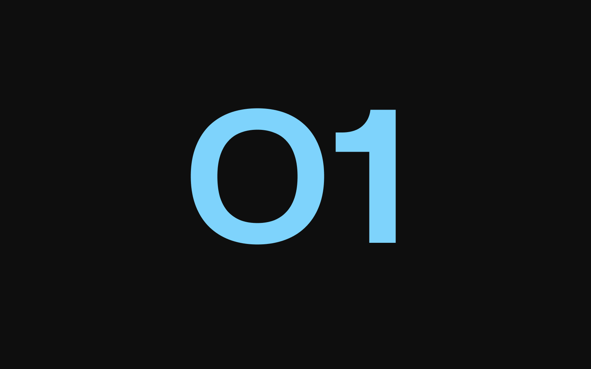

import imageHero from './hero.jpg'

export const project = {
  title: 'Project 1',
  description:
    'Illo sint voluptas. Error voluptates culpa eligendi. Hic vel totam vitae illo. Non aliquid explicabo necessitatibus unde. Sed exercitationem placeat consectetur nulla deserunt vel. Iusto corrupti dicta.',
  image: { src: imageHero },
  date: '2023-08',
  service: 'Web Development',
}

export const metadata = {
  title: project.title,
  description: project.description,
}

## Project 1

Lorem ipsum dolor, sit amet consectetur adipisicing elit. Aliquam vitae magnam, sequi sunt dolorem commodi. Aut pariatur nesciunt est tempora voluptate temporibus, magnam vitae. Assumenda pariatur qui eos ab hic quos explicabo mollitia aperiam debitis eveniet magnam reprehenderit numquam dicta id quas, quasi cum ex quaerat, cumque dolore repellendus laudantium.

Assumenda pariatur qui eos ab hic quos explicabo mollitia aperiam debitis eveniet magnam reprehenderit numquam dicta id quas, quasi cum ex quaerat, cumque dolore repellendus laudantium. Aut pariatur nesciunt est tempora voluptate temporibus, magnam vitae. Aliquam vitae magnam, sequi sunt dolorem commodi.

### Pariatur laudantium

- **Repellendus** — dolore repellendus laudantium.
- **Assumenda** — voluptate temporibus, magnam vitae.
- **Reprehenderit** — mollitia nesciunt est tempora.

Aliquam vitae magnam, sequi sunt dolorem commodi. Aut pariatur nesciunt est tempora voluptate temporibus, magnam vitae.
